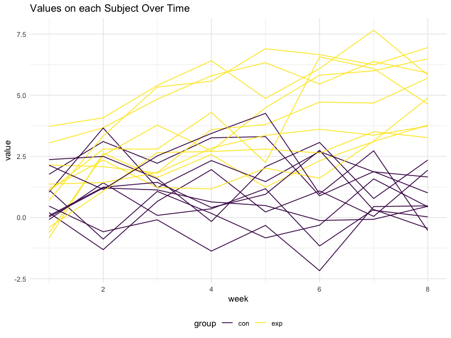

p8105_hw5_yl5227
================
Jennifer Li
2023-11-15

# Problem 1

Import dataset, create variable.

``` r
df_homocide = 
  read_csv("data/homicide-data.csv", na = c("", "NA", "Unknown")) |> 
  mutate(
    city_state = str_c(city, state, sep = ", "),
    status = case_when(
      disposition == "Closed without arrest" ~ "unsolved",
      disposition == "Open/No arrest" ~ "unsolved",
      disposition == "Closed by arrest" ~ "solved",
      ))
```

    ## Rows: 52179 Columns: 12
    ## ── Column specification ────────────────────────────────────────────────────────
    ## Delimiter: ","
    ## chr (8): uid, victim_last, victim_first, victim_race, victim_sex, city, stat...
    ## dbl (4): reported_date, victim_age, lat, lon
    ## 
    ## ℹ Use `spec()` to retrieve the full column specification for this data.
    ## ℹ Specify the column types or set `show_col_types = FALSE` to quiet this message.

This dataset gathered data on homicides in 50 large U.S. cities. The
resulting dataframe has 52179 entries, on variables that include the
victim name, race, age, and sex; the date the homicide was reported; and
the location of the homicide. In cleaning, I created a `city_state`
variable that includes both city and state, and a `status` variable to
indicate whether the case was closed by arrest. I also excluded one
entry in Tulsa, AL, which is not a major US city and is most likely a
data entry error.

Let’s summarize total number of homicides and unsolved homicides within
cities.

``` r
df_city_homcide =
  df_homocide |> 
  select(city_state, status) |> 
  summarize(
    total_homocide = n(),
    unsolved_homocide = sum(status == "unsolved"))
```

# Problem 2

This zip file contains data that allows tracking of changes in
observations over multiple weeks for each subject within their assigned
group.

Create a tidy dataframe containing data from all participants, including
the subject ID, arm, and observations over time.

``` r
df_all_participants =
  tibble(
    file_names = list.files(path = "data", pattern = "(con|exp)_\\d\\d.csv", full.names = TRUE),
    data = map(file_names, read_csv)) |> 
  separate(file_names, into = c("group", "subject_id"), sep = "\\_") |> 
  mutate(
    group = str_remove(group, "data/"),
    subject_id = str_remove(subject_id, ".csv")
  ) |> 
  unnest(data) |> 
  pivot_longer(
    week_1:week_8,
    names_to = "week",
    names_prefix = "week_",
    values_to = "value"
  ) |> 
  mutate(week = as.numeric(week))

df_all_participants
```

    ## # A tibble: 160 × 4
    ##    group subject_id  week value
    ##    <chr> <chr>      <dbl> <dbl>
    ##  1 con   01             1  0.2 
    ##  2 con   01             2 -1.31
    ##  3 con   01             3  0.66
    ##  4 con   01             4  1.96
    ##  5 con   01             5  0.23
    ##  6 con   01             6  1.09
    ##  7 con   01             7  0.05
    ##  8 con   01             8  1.94
    ##  9 con   02             1  1.13
    ## 10 con   02             2 -0.88
    ## # ℹ 150 more rows

The provided dataframe `df_all_participants` contains longitudinal data
from a study with both control and experimental groups. It has a total
of 160 entries, structured on variables that include `group` to specify
the arm (control or experimental), `subject_id` for participant
identification, `week` to denote the time point of the observation, and
`value` representing the measurement or observation recorded. Each
participant’s data is compiled in a distinct file, named with their
respective subject ID and group designation.

Make a spaghetti plot

``` r
df_all_participants |> 
  ggplot(aes(x = week, y = value, group = str_c(subject_id,group), color = group)) +
  geom_line() +
  labs(title = "Values on each Subject Over Time")
```



In the control group, the data points for each participant remain
relatively stable, showing little change over time. However, in the
experimental group, there’s a clear pattern of growth, with measurements
for each subject showing an upward trajectory with each passing week.

# Problem 3
